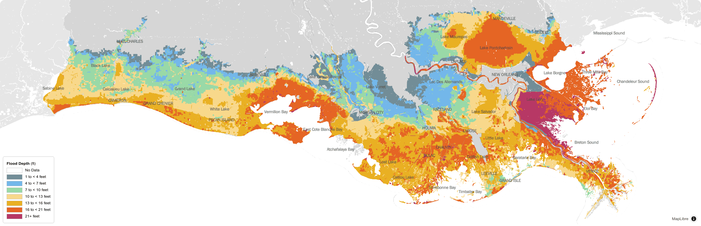
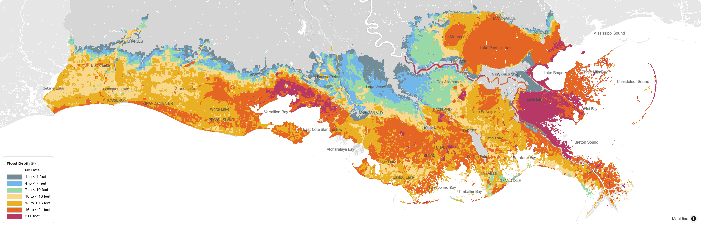

# Flood Depths

## Lower Scenario

<figure>
    
    <figcaption>Flood Depths, 1% Annual Exceedance Probability, Future Without Action, Lower Scenario, Year 50.</figcaption>
</figure>

Storm surge-based flood depths are projected to increase in the future as more intense storms interact with higher sea levels, lower land, and with the continued degradation of coastal wetlands that can act as natural defenses. Under the lower environmental scenario, an additional 1.6 ft of sea level rise is expected over the next 50 years, adding height to already damaging storm surge levels. As a result of climate change, hurricanes are assumed to increase in intensity by 5% over the same period, exacerbating the risk posed by storm surge. Lower scenario projections of storm surge-based flood depths at locations across the coast with a flood depth of 1% Annual Exceedance Probability (AEP) are displayed above. That means that every year there is a 1% chance that these flood depths will be met or exceeded. These projections are for a future without the structural risk reduction projects selected for the 2023 Coastal Master Plan and show significant risk of flooding in communities across the coast.

## Higher Scenario

<figure>
    
    <figcaption>Flood Depths, 1% Annual Exceedance Probability, Future Without Action, Higher Scenario, Year 50.</figcaption>
</figure>

Higher scenario projections of storm surge-based flood depths at locations across the coast with a flood depth of a 1% AEP are illustrated above. When compared to the lower scenario, it is clear that more severe climate change impacts — such as sea level rise of up to 2.5 ft and increased storm intensity of up to 10% at Year 50 — combined with higher subsidence have a significant impact on the potential depth of storm surge-based flooding. The northward migration of the storm surge-impact and the expansion of areas projected to experience the largest storm surge heights (more than 21 ft in some areas) can be seen under the higher scenario without the implementation of 2023 Coastal Master Plan projects.

Due to uncertainty around future climate conditions, both the lower and higher environmental scenarios are used in the development of the 2023 Coastal Master Plan to represent a range of future landscapes and to plan robust projects that can provide benefits for the coast under any plausible future condition.

Go to Chapter 5: Take Action to read about how CPRA addresses these anticipated challenges through protection and restoration projects.
