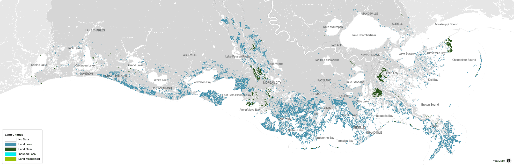
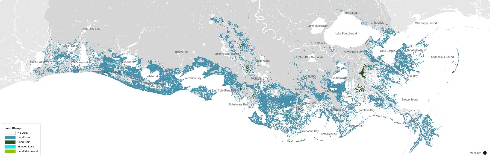

# Land Change

## Lower Scenario

<figure>
    
    <figcaption>Land Change, Future Without Action, Lower Scenario, Year 50.</figcaption>
</figure>

Because Louisiana’s coast is a dynamic system that will continue to be impacted by a changing climate, environmental conditions 50 years in the future will be different from those experienced today. Predictions of the FWOA landscape define the scale of the land loss challenge in coming decades and serve as a baseline against which candidate projects can be compared to determine their potential benefit. 

Land change projections for the master plan’s lower environmental scenario, one of two scenarios used for project selection, are shown above. Under this environmental scenario, coastal Louisiana would experience moderate climate change impacts, including sea level rise of 1.6 ft over 50 years. Without the 2023 Coastal Master Plan projects, the lower scenario ICM outputs predict 1,100 sq mi of land lost in that same time period. Much of the projected loss is concentrated in lower basins and on marsh edges.

## Higher Scenario

<figure>
    
    <figcaption>Land Change, Future Without Action, Higher Scenario, Year 50.</figcaption>
</figure>

Planning under uncertainty requires considering multiple possible future environmental scenarios to understand the range of possible outcomes that the master plan may need to address. Land change projections for the master plan’s higher environmental scenario after 50 years are shown above. Under this possible environmental scenario, coastal Louisiana would experience severe climate change impacts, including sea level rise of up to 2.5 ft over the next 50 years. Without the projects selected for the 2023 Coastal Master Plan, the higher scenario ICM outputs predict extensive land loss of 3,000 sq mi over that same time period, with every region of the coast affected. 

Due to uncertainty around future climate conditions, both scenarios are used in the development of the 2023 Coastal Master Plan to represent a range of future landscapes and to select robust projects that can provide benefits for the coast for whatever future conditions transpire.

Go to Chapter 5: Take Action to read about how CPRA addresses these anticipated challenges through protection and restoration projects.
