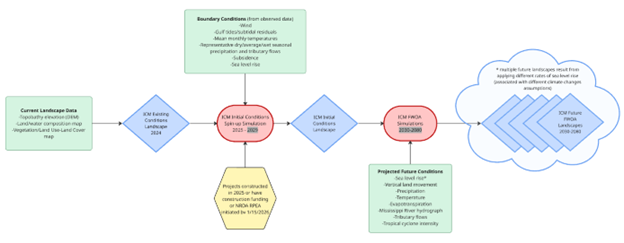
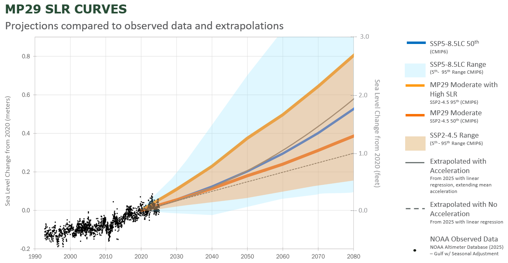
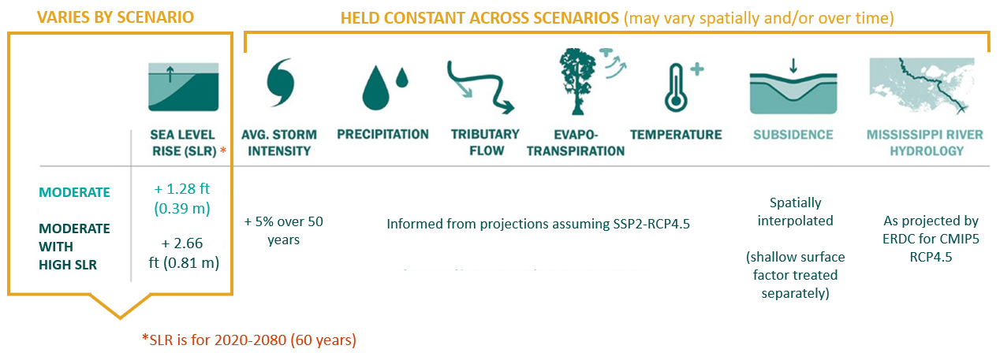
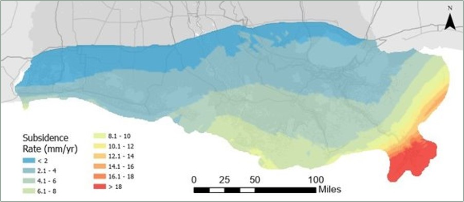

# Planning with Models

## Using Predictive Modeling to Make Informed Decisions

**Since the 2007 Coastal Master Plan, the state has clearly articulated goals and objectives around reducing land loss, reducing storm surge-based flood risk, and realizing a future coast that supports how Louisianans live, work, and play. Each subsequent master plan used the most up-to-date information to predict how the coast may look in the future due to continued environmental changes.**

A combination of observations and scientific projections indicate that rising sea level, more intense hurricanes, subsidence, and other environmental stressors will have major impacts on the Louisiana coast, but exactly when, where, and how remains uncertain. In the face of this uncertainty, planning how to adapt to a range of potential futures and achieve the goals of the state’s coastal program requires the use of predictive models and scenarios to represent the range of possible future conditions.

Predictive models can be used to understand potential future conditions and to test the impact of different strategies in meeting our goals. For example, CPRA’s landscape model, the ICM, was specifically developed to support the master plan process. It represents the landscape of coastal Louisiana and the physical and ecological processes, and feedbacks between them, that drive coastal change. This model uses established understanding of coastal dynamics to predict changes on the landscape. 

The interaction between storms, waves, and the landscape is represented in two other models, ADCIRC and SWAN, which predict changes in storm surge flooding. These predictive models, when supplied with information about landscape change and sea level rise, show patterns of storm surge-based flood risk and how it changes over time.

## The Future Depends on Where You Start

**When modeling the possible futures of coastal Louisiana, outcomes are significantly impacted by the chosen starting point.** The first step to develop modeled Future Without further Action (FWOA) landscapes for each iteration of master planning is to update landscape data to reflect the changes that have occurred since they were updated in 2018 for the 2023 Coastal Master Plan analysis. This update accounts for landscape changes such as continued land loss, land gain, surface elevation changes, construction of restoration projects, and changes in land use and vegetation cover. For 2029 master plan modeling, we used survey and satellite data available through the end of the year 2024 to develop the _**existing conditions landscape**_. Experts spent most of 2025 gathering and preparing that data for use in our models. For technical details on the existing conditions data sources and processing, see [LINK].

<figure>
    
    <figcaption>Master Plan Modeling Starting Points. Multiple pieces of information are used together to develop the existing conditions landscape, the initial conditions landscape, and finally the FWOA landscapes we use for developing the coastal master plan.</figcaption>
</figure> 

CPRA and its partners have continued to develop and implement projects since the cut off for existing conditions data at the end of 2024. We next developed an _**initial conditions landscape**_ to reflect this additional progress and boundary conditions changes expected through 2030. The initial conditions landscape represents 2030 and is developed by running the ICM for a ‘spin-up’ period (2025-2029), continuing environmental trends and adding additional projects to the landscape as they are expected to be built. 

_**Boundary conditions**_ are key component of developing the initial conditions landscape. They are external inputs to the models that vary over time, such as water levels, river flows, or wind speeds. They are based on historical conditions and trends, and/or predictions of future conditions. The storm surge and risk assessment models are also informed by the boundary conditions imposed on the ICM as well as information about existing structures and infrastructure across the coast. 

The _**projects**_ added to the model to create the initial conditions landscape will influence how candidate projects are evaluated later in the master planning process, so CPRA must be reasonably confident in which projects to include and how they are represented. For that reason, we only include projects that have reached certain milestones as part of initial conditions:  **To be included in initial conditions, projects had to have completed construction, be fully funded for construction, or be included in an initiated NRDA Restoration Plan and Environmental Assessment for implementation before we began the spin-up simulations in January 2026.** This means there is a slight disconnect between the 2026 cut off for project inclusion and the year 2030 conditions the model is intended to represent, but we believe it is safer to infer the influence of projects built in late 2026-2029 rather than being unable to remove the influence of a project that might have changed significantly prior to construction.

Some of the not-yet-constructed projects included in the MP29 initial conditions are very large and are expected to have significant impacts on the future landscape following implementation. Of particular note are several projects that were included in the 2023 Coastal Master Plan and have been successful in advancing toward construction since that time.

*add new first example project

Another project that is assumed to be on the landscape in initial conditions is the River Reintroduction Into Maurepas Swamp. This project includes a gated diversion structure in Reserve, Louisiana, and a conveyance channel crossing Highway 61 and Interstate 10 to allow a maximum of 2,000 cubic feet per second (cfs) of water from the Mississippi River to restore natural swamp hydrology and reduce salinity levels in the Maurepas Basin. Construction of the River Reintroduction Into Maurepas Swamp project has begun and is expected to be complete [FILL IN]. This diversion project was selected as a mitigation feature for the West Shore Lake Pontchartrain levee project, which is a largescale structural risk reduction project currently under construction which is building over 18 mi of levee and floodwalls on the east bank in the river parishes of St. James, St. John the Baptist, and St. Charles. The integrated risk reduction and restoration project features from these two projects marks an important step forward in recognizing the value in mitigating wetland impacts directly adjacent to projects; this will increase the resiliency of the West Shore Lake Pontchartrain Risk Reduction project and is an on-the-ground example of the master plan’s emphasis on both reducing coastal flood risk and restoring coastal habitats.

It is important to note that because these projects are in initial conditions their benefits are not attributed to the 2029 Coastal Master Plan. Those benefits, however, are an important part of Louisiana’s coastal program and are the result of targeted, significant investment in large-scale restoration projects.

## Future Scenarios

Our FWOA modeling predicts how coastal conditions may change over 50 years, from 2030 through 2080, if we take no further action to restore and reduce risk across our coast beyond what is represented in the initial conditions landscape. 

The future is uncertain with regard to how climate, the landscape, and the built environment may evolve and, therefore, assumptions about how these conditions may change over 50 years must be made to make landscape- and storm damage-related predictions. We know that sea level rise and subsidence, along with precipitation, temperature, tributary flows, and hurricane intensity are key drivers that influence our coastal landscape. To account for uncertainty in how these variables may change over time, the master plan employs a _**scenario approach**_, using predictive models to illustrate a range of plausible future conditions to inform planning.

For the 2029 Coastal Master Plan, we will explore a wide range of possible scenarios, and from those, two scenarios, referred to as the “moderate” and “moderate with higher sea level rise” scenarios will be applied for project selection. Analyses from previous plans showed that sea level rise was a major driver of landscape change modeled by the ICM and scenario-based projections of future sea level rise are available from several external sources, so development of scenarios for this plan focused on choosing how to capture potential variation in sea level rise into the future. 

Specific projections for sea level rise were selected for project selection scenarios based on climate change modeling and sea level guidance from external sources such as the Intergovernmental Panel on Climate Change (IPCC) and the National Oceanic and Atmospheric Administration (NOAA). Overall, the pattern of sea level rise chosen for the moderate scenario represents a continuation of recent trends in sea level, while the moderate with higher sea-level rise scenario represents a higher projection from within the range anticipated for the same moderate assumptions regarding climate change. Relatively higher sea level rise associated with the moderate with higher sea level rise scenario is expected to lead to more severe impacts, including increased land loss and flood depths compared to the lower scenario.

<figure>
    
    <figcaption>Sea Level Rise Curves for 2029 Coastal Master Planning and Range of Plausible Curves.</figcaption>
</figure>

Once sea level rise rates for the two project selection scenarios were selected, values (or rates) to be applied for other environmental variables (e.g., subsidence, temperature, precipitation, tributary flows) were determined. For the 2029 Coastal Master Plan, only sea level rise will vary across project selection scenarios; values or rates for other environmental variables will reflect anticipated changes over time but will not vary by scenario.

<figure>
    
    <figcaption>Future Scenarios for 2029 Coastal Master Planning.</figcaption>
</figure>

Values or rates were derived from observed data and trends and/or related global climate model outputs, as applicable. For example, a single map of annual subsidence rates was developed through analysis of available global positioning system (GPS) elevation data to be applied across scenarios, while temperature and precipitation modeled over time reflect future changes from historic means projected by climate modeling under moderate climate assumptions aligned with those used to project sea level rise.

<figure>
    
    <figcaption>Subsidence Rates for 2029 Coastal Master Planning.</figcaption>
</figure>

Model outputs from future simulations applying the two scenarios defined for project selection will support delineation of a range of possible future landscapes and damage profiles based on variable projections for sea level rise given moderate assumptions related to climate change. While the use of this scenario approach does not make the future more certain, it does provide for a more complete understanding of what may come. The focus on a possible range of outcomes rather than a single prediction increases confidence that decisions made using outputs from master plan analyses help Louisiana prepare for  future conditions. 
