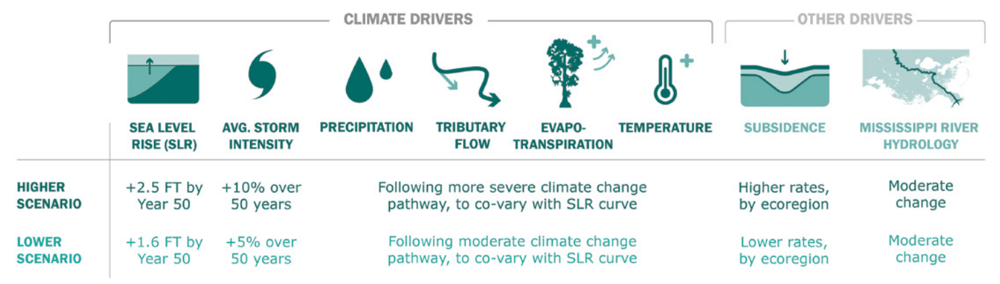
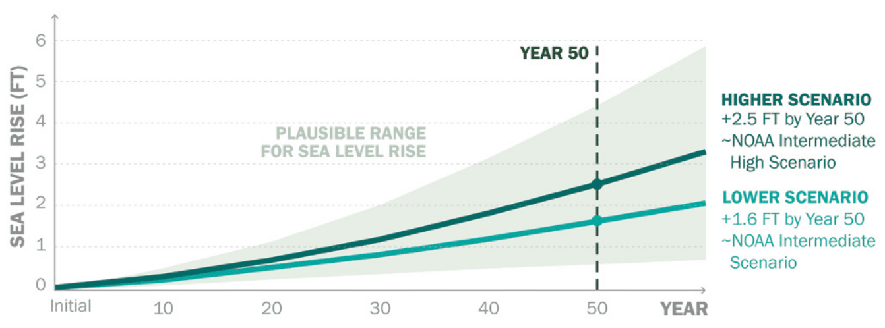

# Planning with Models

Since the 2007 Coastal Master Plan, the state has clearly articulated goals and objectives around reducing land loss, reducing storm surge-based flood risk, and realizing a future coast that supports how Louisianans live, work, and play. Each subsequent master plan used the most up-to-date information to predict how the coast may look in the future due to climate change and other environmental changes.

A combination of observations and scientific projections indicate that rising sea level, more intense hurricanes, and other environmental stressors will have major impacts on coastal systems, but exactly when, where, and how remains uncertain. In the face of this uncertainty, knowing how to adapt to a range of potential futures and achieve the goals of the state’s coastal program requires the use of predictive models to inform decision-making.

Predictive models can be used to understand potential future conditions and to test the impact of different strategies in meeting our goals. For example, the ICM was specifically developed to support the master plan process. It represents the landscape of coastal Louisiana and the physical and ecological processes, and feedbacks that drive coastal change. This model uses established and newly developed understandings of coastal dynamics to predict change on the landscape. The interaction between storms, waves, and the landscape are represented in two other models, ADCIRC and SWAN, which predict changes in storm surge flooding. These predictive models, when supplied with boundary conditions and inputs, produce outputs that reflect the complexity of coastal processes and how they change over time.

Boundary conditions are external inputs to the models that vary over time, such as water levels, river flows, or wind speeds. They are based on historical conditions or predictions of future conditions. Data about elevation, water levels, vegetation, and other aspects of the landscape serve as a starting point, or initial conditions, for the 50-year predictions of landscape change in the ICM. The storm surge and risk assessment models are also informed by the boundary conditions imposed on the ICM as well as information about existing structures and infrastructure across the coast.

<figure>
    
    <figcaption>Environmental Drivers for the Higher and Lower Scenarios.</figcaption>
</figure>

The future is uncertain with regard to climate-related environmental conditions and, therefore, assumptions about how climate will change must be made to make landscape- and storm damage-related predictions. We know that sea level rise and subsidence, along with precipitation, temperature, tributary flows, and hurricane intensity are key environmental drivers that influence our coastal landscape. We also know that there is uncertainty in how these variables may change over time. To make informed decisions, the master plan employs a scenario approach to define a range of plausible future environmental conditions.

## Scenarios and Drivers

For the 2023 Coastal Master Plan, we defined two scenarios, referred to as the "lower" and "higher" scenarios, to drive change within the ICM and ADCIRC+SWAN for use in project selection. Analyses from the 2017 Coastal Master Plan showed that two variables, subsidence and sea level rise, had the greatest impact on model outputs; therefore, development of scenarios for this plan began with choosing values for these two model inputs. Sea level rise rates were selected based on climate change modeling from external sources such as the National Oceanic and Atmospheric Administration (NOAA) sea level guidance and the Intergovernmental Panel on Climate Change (IPCC). Subsidence rates were determined through analysis of shallow and deep subsidence rates derived from CRMS and global positioning system (GPS) elevation data, with a greater rate of shallow subsidence applied in the higher scenario than in the lower. Overall, the lower scenario represents more moderate future conditions, while the higher scenario represents more severe conditions with greater sea level rise and shallow subsidence, leading to increased land loss and flood depths compared to the lower scenario.

<figure>
    
    <figcaption>Sea Level Rise Curves for Project Selection and Range of Plausible Curves.</figcaption>
</figure>

Once sea level rates were selected for the two scenarios, values for the other scenario variables were derived from related global climate model outputs. When considered together, the model outputs of the two scenarios delineate a range of possible future landscapes and damage profiles that can be used to inform decision- making. While the use of this scenario approach does not make the future more certain, it does provide a better understanding of what may come and, thereby, increases confidence in the master plan being well-suited for whatever the future holds. Additional scenario values are used in the prediction of storm surge-based flood damage in CLARA. The analysis does not necessarily assume that all storm surge protection levees hold when storm flooding occurs. Rather, CLARA uses two fragility (i.e., infrastructure performance) scenarios: 

1. a no fragility scenario, where levees hold, and 
2. a fragility scenario that uses assumptions developed by USACE in post-Katrina studies regarding when and where levee breaches could occur.

Similarly, whether interior drainage pumps continue to operate during a storm to remove rainfall from poldered areas is also dependent on a variety of unpredictable factors. Therefore, CLARA uses three pumping scenarios:

1. drainage pumps are fully operational, 
2. pumps operate at 50% capacity, or 
3. no pumping.

Additional details on scenario values can be found in Appendix B: Scenario Development & Future Conditions.
