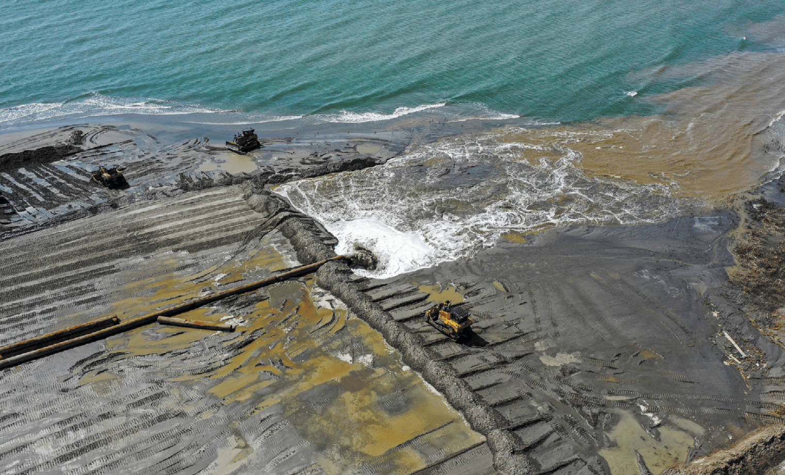
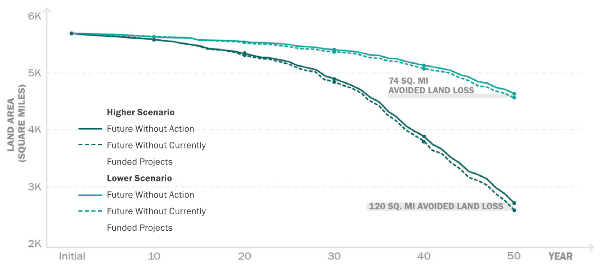
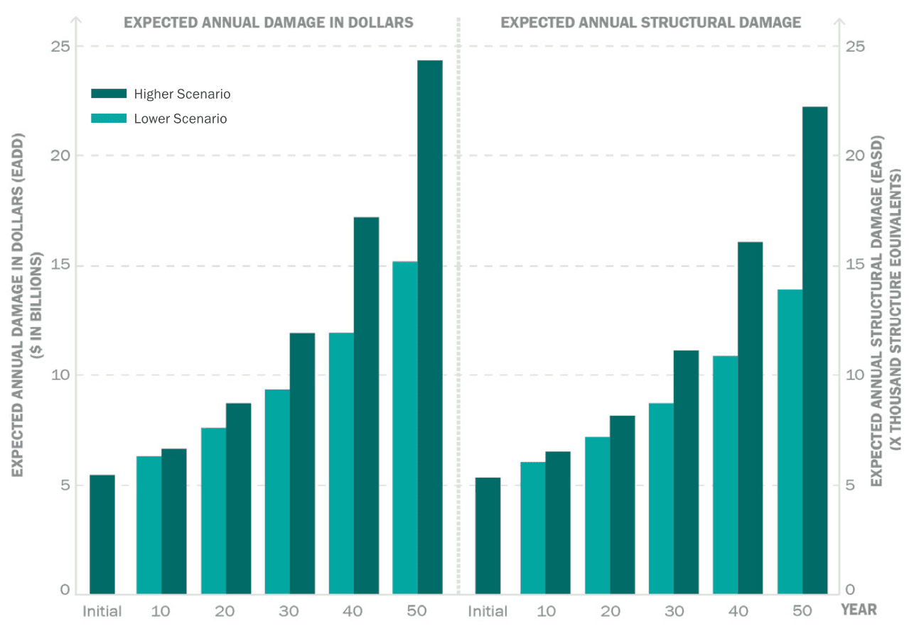

# The Current Outlook

When modeling the possible futures of coastal Louisiana, outcomes are significantly impacted by the chosen starting point. As part of the master plan development process, the starting landscape was updated from the one used in the 2017 Coastal Master Plan. This landscape update reflected changes in surface elevation, land/water distribution, and vegetation cover and was adjusted to include new restoration or levee projects that were recently constructed.

<figure>
    
    <figcaption>Operations at West Belle Headland after Hurricane Ida, 2021 (CPRA)</figcaption>
</figure>

It is important that the initial landscape conditions used in the modeling represent the on the ground conditions as much as possible so that there is confidence that model outputs reasonably reflect landscape responses to candidate restoration and risk reduction projects.

## Future Without Action Currently Funded Projects (FWOCFP)

As part of the 2023 Coastal Master Plan development, the ICM was run for 50 years under a condition referred to as "Future Without Currently Funded Projects (FWOCFP)." For these model runs, the only restoration or risk reduction projects modeled on the landscape are those that have already been constructed. Some of these projects are included in the existing conditions coastwide digital elevation model (DEM), which captures the location and elevation of these projects along with the rest of the landscape features.

The characteristics of other projects or features that were constructed after data were collected for the DEM were imposed on the model based on engineering design documents, conversations with local landowners, institutions like levee boards, and others who have knowledge of their community and these features.

These model runs serve to demonstrate the possible future of coastal Louisiana if all future planned restoration and risk reduction efforts were halted and the coastal program only continued to operate existing projects. Given that funding for future projects is not guaranteed and that unforeseen circumstances could complicate the process of implementing projects that are already funded, comparing these model runs to those with projects that have funding but are not yet constructed can provide insight into the long-term effects of ongoing investments in the coastal program.

The 2023 Coastal Master Plan, however, does not assume this FWOCFP landscape to be the starting point. The next section provides additional detail about what is included in the master plan’s starting landscape or "Future Without Action (FWOA)."

## Future Without Action (FWOA)

The FWOA condition in the 2023 Coastal Master Plan serves as the baseline for predicting changes to the landscape and storm surge-based risk into the future. The initial landscape represented in the ICM and passed to the ADCIRC+SWAN and CLARA models reflects a snapshot in time while the coastal program continues its activities. Thus, a decision must be made about how to include the effects of ongoing work in the modeling. 
To start, completed projects and existing landscape features are included in the DEM, as for FWOCFP. Then, additional projects and features are included based upon expectations around progress in implementing those projects. This includes projects that have undergone significant advancements in engineering and design, those that have availability of funding for construction, and those for which construction permits are currently being obtained.

Some of the projects included in FWOA are very large and are expected to have significant impacts on the future landscape following implementation. Of particular note are several projects that were included in the 2017 Coastal Master Plan and have been successful in advancing toward construction since that time.

For the first time, two large-scale sediment diversions off of the Mississippi River — the Mid-Barataria and Mid-Breton Sediment Diversions — are included in FWOA. These projects, when implemented, will divert sediment and water from the river when flows are favorable to transport sediment and deliver it to the Barataria and Breton basins, respectively. The two mid-basin sediment diversions are anticipated to reconnect the adjacent basins to the Mississippi River as a source of sediment to nourish and maintain existing wetlands and to create coastal wetlands over time, in much the same way as southeast Louisiana was originally built by the Mississippi River before levee construction (see Chapter 2 for more details about the history of coastal Louisiana’s landscape).

Analysis from the 2017 Coastal Master Plan and subsequent engineering and design studies suggests that the Mid-Barataria Sediment Diversion has the potential to build 21 sq mi of new land over a 50-year period. In September 2022, USACE issued the final environmental impact statement (EIS) for this project. Federal and state permits and permissions for construction are under review as of December 2022. The Mid-Breton Sediment Diversion project is currently in advanced stages of design, and it is anticipated that initial construction could commence upon permit approval.

Another project that is assumed to be on the landscape in FWOA is the River Reintroduction Into Maurepas Swamp. This project includes a gated diversion structure in Reserve, Louisiana, and a conveyance channel crossing Highway 61 and Interstate 10 to allow a maximum of 2,000 cubic feet per second (cfs) of water from the Mississippi River to restore natural swamp hydrology and reduce salinity levels in the Maurepas Basin. Design of the River Reintroduction Into Maurepas Swamp project is nearly complete and construction is expected to begin in 2023. This diversion project was selected as a mitigation feature for the West Shore Lake Pontchartrain levee project, which is a large-scale structural risk reduction project currently under construction which is building over 18 mi of levee and floodwalls on the east bank in the river parishes of St. James, St. John the Baptist, and St. Charles. The integrated risk reduction and restoration project features from these two projects marks an important step forward in recognizing the value in mitigating wetland impacts directly adjacent to projects; this will increase the resiliency of the West Shore Lake Pontchartrain Risk Reduction project and is an on-the-ground example of the master plan’s emphasis on both reducing coastal flood risk and restoring coastal habitats.

The impact of these projects can be seen in output maps for FWOA model runs (see maps 3.1-3.4) showing land creation that helps to strengthen wetlands in both basins. It is important to note that because these projects are in FWOA their benefits are not attributed to the 2023 Coastal Master Plan. Those benefits, however, are an important part of Louisiana’s coastal program and are the result of targeted, significant investment in large-scale restoration projects.

# Future Without Action Outcomes

Even with these projects assumed to be on the ground, the FWOA landscape realizes significant land loss and increases to storm surge-based flood depths over the 50-year model prediction. Under the lower scenario, 1,100 sq mi of land are lost at Year 50; an equivalent amount of loss occurs by Year 34 under the higher scenario, with up to 3,000 sq mi lost at Year 50 under those more severe environmental conditions. 

<figure>
    
    <figcaption>Land Area Over 50 Years, FWA and FWOCFP, Higher and Lower Scenario.</figcaption>
</figure>

This land loss impacts not only the landscape configuration and ecology but also results in changes to storm surge and waves and, thus, flood-related damages. Without additional project implementation, flood damages could increase by up to $19 billion annually, with 17,000 additional structures damaged due to significant increases in flood depths. These possible futures without action reveal the challenges that the 2023 Coastal Master Plan was developed to address.

<figure>
    
    <figcaption>Expected Annual Damage in Dollars (EADD) and Expected Annual Structural Damage (EASD), Over 50 Years, Future Without Action, Higher and Lower Scenario.</figcaption>
</figure>
